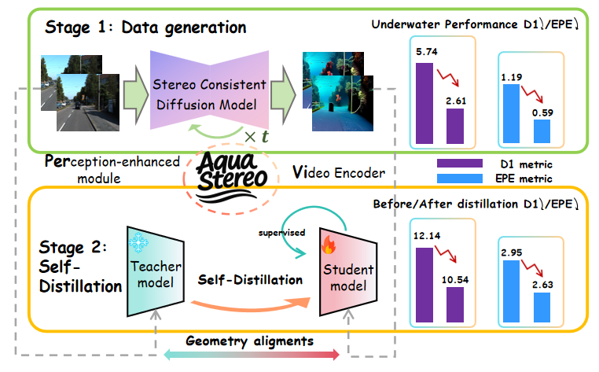
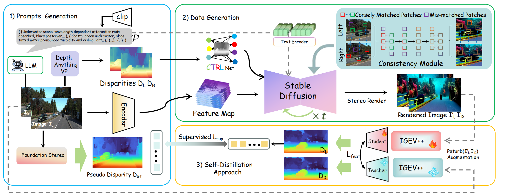
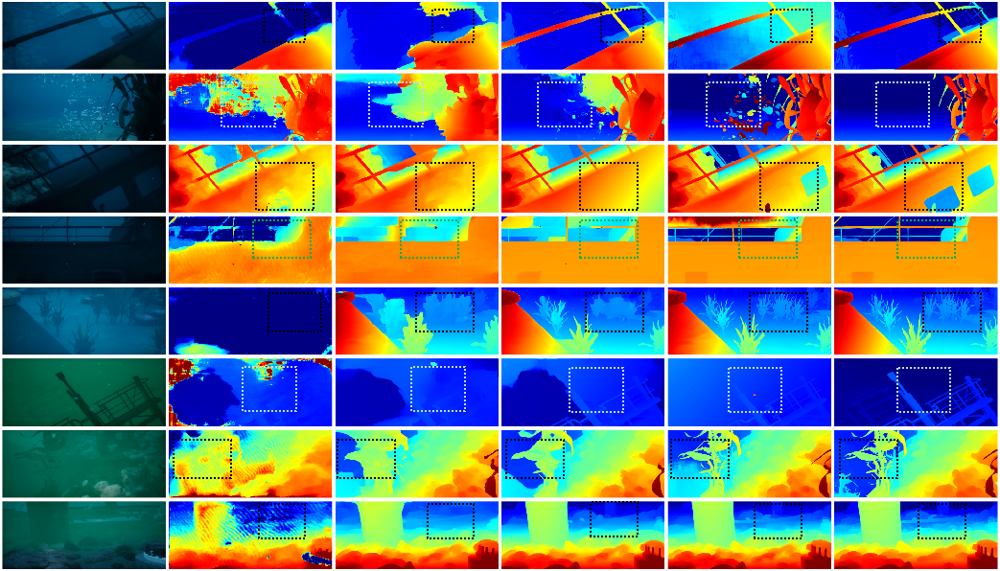

# AquaStereo (ECCV2026)

<p align="center">
  
</p>

<div align="center">

**AquaStereo:Enabling Underwater Stereo Matching via Depth-Conditioned Diffusion and Geometry Self-Distillation**

<a href="YOUR_ARXIV_LINK_HERE">
  
</a>
<a href="https://huggingface.co/wqz123/AquaStereo/tree/main">
  
</a>
<a href="YOUR_DEMO_LINK_HERE">
  
</a>

</div>

---

## Overview

Learning-based stereo matching models often struggle in underwater environments, where color attenuation, turbidity, low texture, and scarce in-domain training data make reliable correspondence estimation difficult. **AquaStereo** is a perception-enhanced underwater stereo matching framework designed to improve robustness and zero-shot generalization in these degraded scenes.


This repository contains the official implementation of **AquaStereo**, including model definitions, training scripts, evaluation scripts, and visualization examples.

---

## Demo


Demo video link: **YOUR_DEMO_LINK_HERE**

---

## Network Architecture

<p align="center">
  
</p>

The overall architecture of AquaStereo is shown above. The model takes a rectified stereo image pair as input and predicts the corresponding disparity map.

---

## Visualization


<p align="center">
  
</p>


---

## Installation

The environment follows the same setting as the reference implementation.

* NVIDIA RTX 3090
* Python 3.8
* CUDA 11.8

### Create a virtual environment

```bash
conda create -n aquastereo python=3.8
conda activate aquastereo
```

### Install dependencies

```bash
pip install torch==2.0.1 torchvision==0.15.2 torchaudio==2.0.2 --index-url https://download.pytorch.org/whl/cu118
pip install tqdm
pip install scipy
pip install opencv-python
pip install scikit-image
pip install tensorboard
pip install matplotlib
pip install timm==0.6.13
pip install mmcv==2.1.0 -f https://download.openmmlab.com/mmcv/dist/cu118/torch2.1/index.html
pip install accelerate==1.0.1
pip install gradio_imageslider
pip install gradio==4.29.0
```

---

## Model Weights

Backbone pretrained weights are required only for training. AquaStereo checkpoints are used for evaluation and can also be used to resume training.

### Backbone Pretrained Weights

| Component | File name | Link |
| :-------: | :-------- | :--- |
| X3D | `X3D_L.pyth` | [Download](https://dl.fbaipublicfiles.com/pytorchvideo/model_zoo/kinetics/X3D_L.pyth) |
| DINOv2 ViT-B | `dinov2_vitb14_reg4_pretrain.pth` | [Download](https://dl.fbaipublicfiles.com/dinov2/dinov2_vitb14/dinov2_vitb14_reg4_pretrain.pth) |
| DINOv2 ViT-S | `dinov2_vits14_reg4_pretrain.pth` | [Download](https://dl.fbaipublicfiles.com/dinov2/dinov2_vits14/dinov2_vits14_reg4_pretrain.pth) |

### AquaStereo Checkpoints

| Model | ViT backbone | Link |
| :---: | :----------: | :--- |
| AquaStereo-ViT-B | ViT-B | [Download](https://huggingface.co/wqz123/AquaStereo/resolve/main/AquaStereo_vitb_best.pth) |
| AquaStereo-ViT-S | ViT-S | [Download](https://huggingface.co/wqz123/AquaStereo/resolve/main/AquaStereo_vits_best.pth) |

Please place the training backbone pretrained weights under:

```bash
pretrained/
```

Example:

```text
pretrained/
+-- X3D_L.pyth
+-- dinov2_vitb14_reg4_pretrain.pth
+-- dinov2_vits14_reg4_pretrain.pth
```

Please place AquaStereo checkpoints under:

```bash
checkpoints/
```

Example:

```text
checkpoints/
+-- aquastereo_vitb.pth
+-- aquastereo_vits.pth
```

---

## Required Data

The following datasets can be used for training and evaluation:

* [SceneFlow](https://lmb.informatik.uni-freiburg.de/resources/datasets/SceneFlowDatasets.en.html)
* [KITTI](https://www.cvlibs.net/datasets/kitti/eval_scene_flow.php?benchmark=stereo)
* [ETH3D](https://www.eth3d.net/datasets)
* [Middlebury](https://vision.middlebury.edu/stereo/submit3/)
* [TartanAir](https://github.com/castacks/tartanair_tools)
* [CREStereo Dataset](https://github.com/megvii-research/CREStereo)
* [FallingThings](https://research.nvidia.com/publication/2018-06_falling-things-synthetic-dataset-3d-object-detection-and-pose-estimation)
* [InStereo2K](https://github.com/YuhuaXu/StereoDataset)
* [Sintel Stereo](http://sintel.is.tue.mpg.de/stereo)

Please organize the datasets according to your local configuration and update the dataset paths in the corresponding config or script files.

---

## Evaluation

To evaluate AquaStereo, run:

```bash
python evaluate_stereo.py --restore_ckpt ./checkpoints/aquastereo_vitb.pth --vit_size vitb --dataset kitti
```

You can replace `kitti` with other supported datasets, for example:

```bash
python evaluate_stereo.py --restore_ckpt ./checkpoints/aquastereo_vitb.pth --vit_size vitb --dataset sceneflow
python evaluate_stereo.py --restore_ckpt ./checkpoints/aquastereo_vits.pth --vit_size vits --dataset eth3d
python evaluate_stereo.py --restore_ckpt ./checkpoints/aquastereo_vitb.pth --vit_size vitb --dataset middlebury_F
```

---

## Training

To train AquaStereo with a single GPU, run:

```bash
python train.py \
  --vit_size vitb \
  --pretrained_change3d ./pretrained/X3D_L.pyth \
  --pretrained_dino ./pretrained/dinov2_vitb14_reg4_pretrain.pth
```

To train the ViT-S version, switch both `--vit_size` and the DINOv2 pretrained weight:

```bash
python train.py \
  --vit_size vits \
  --pretrained_change3d ./pretrained/X3D_L.pyth \
  --pretrained_dino ./pretrained/dinov2_vits14_reg4_pretrain.pth
```

For distributed training, run:

```bash
CUDA_VISIBLE_DEVICES=0,1,2,3 python train_ddp.py \
  --vit_size vitb \
  --pretrained_change3d ./pretrained/X3D_L.pyth \
  --pretrained_dino ./pretrained/dinov2_vitb14_reg4_pretrain.pth
```

or use `torchrun`:

```bash
CUDA_VISIBLE_DEVICES=0,1,2,3 torchrun --nproc_per_node=4 train_ddp.py \
  --vit_size vitb \
  --pretrained_change3d ./pretrained/X3D_L.pyth \
  --pretrained_dino ./pretrained/dinov2_vitb14_reg4_pretrain.pth
```

The X3D and DINOv2 weights above are used during training. Evaluation only requires the AquaStereo checkpoint specified by `--restore_ckpt`.

To resume from an AquaStereo checkpoint, add `--restore_ckpt ./checkpoints/aquastereo_vitb.pth` or `--restore_ckpt ./checkpoints/aquastereo_vits.pth`. Please modify dataset paths, batch size, training schedule, and checkpoint paths according to your local environment.

---

## Project Structure

```text
AquaStereo-main/
+-- core/
+-- dinov2/
+-- fig/
|   +-- network.png
|   +-- teaser.png
|   +-- visualization.png
+-- pretrained/
+-- checkpoints/
+-- evaluate_stereo.py
+-- train.py
+-- train_ddp.py
+-- README.md
+-- requirements.txt
```

---

## Notes

* Large model weights are not included in this repository.
* Please download pretrained weights from Hugging Face.
* Dataset files should be prepared manually.
* Checkpoints, logs, and output files are recommended to be excluded from Git tracking.

Recommended `.gitignore` rules:

```gitignore
# model weights and checkpoints
*.pth
*.pyth
*.pt
*.ckpt
*.safetensors
*.onnx

pretrained/
checkpoints/
ckpts/
weights/
outputs/
output/
logs/
runs/
wandb/

# python cache
__pycache__/
*.pyc
```

---

## Citation

If you find AquaStereo useful in your research, please consider citing our work:

```bibtex
@inproceedings{aquastereo,
  title     = {AquaStereo},
  author    = {},
  booktitle = {},
  year      = {}
}
```

---

## Acknowledgements

This project is based on [RAFT-Stereo](https://github.com/princeton-vl/RAFT-Stereo), [GMStereo](https://github.com/autonomousvision/unimatch), [CoEx](https://github.com/antabangun/coex), and [IGEV++](https://github.com/gangweix/IGEV-plusplus). We thank the original authors for their excellent works.

